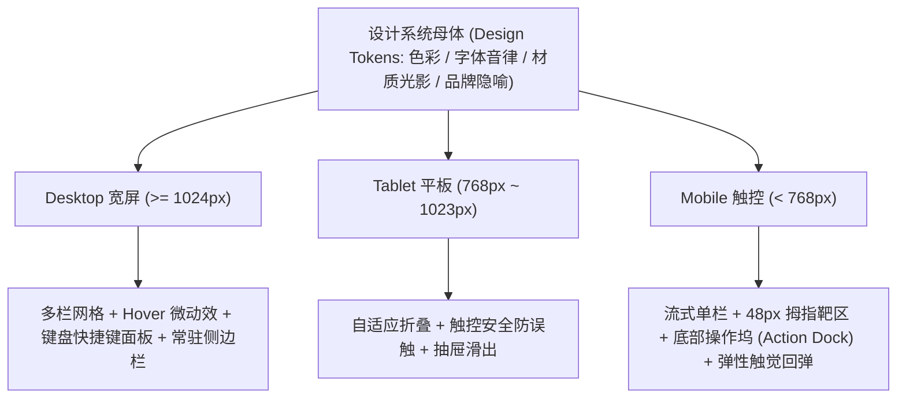

# 全端同构视觉母体库 (Unified Cross-Device Aesthetic Archetypes)

每个母体包含：**业务场景灵感指南（天然温床、破局跨界、无限混血调校） + 精确 Design Tokens（颜色/字体/行距） + 专属排版手艺（如 Escaped UI、Offset Shadow、Dot Grid） + 完整代码骨架**。

> **核心哲学：跨端同构，自适应推断**。
> 美学母体是界面的单一真理源（Single Source of Truth），定义了色彩语义、材质光影、排版音律与情绪张力。**不应人为割裂“PC 端”与“移动端”风格**。端只是母体在不同物理尺度与交互介质上的自适应投影——AI 应当依据设计系统的深层语言，自主推断出最适合当前终端（桌面宽屏、触控平板、掌上移动）的最佳交互结构。

---

## 📚 10 大全端美学母体标准库

| 母体名称 | 核心标杆 | 核心隐喻与视觉基因 | 规范文件 |
| :--- | :--- | :--- | :--- |
| **Playful Stationery (复古文具手账流)** | `SayBriefly`, `Pitch`, `PostHog` | 暖米白纸张 + 常春藤墨绿 + 荧光便利贴黄 + 撕纸虚线 + 手绘涂鸦批注 | [playful_stationery.md](archetypes/playful_stationery.md) |
| **Enterprise Narrative (现代企业工装流)** | `Allwhere`, `Stripe`, `HashiCorp` | IBM Plex 工业严谨 + 青瓷水蓝与暖珊瑚橙 + 破框溢出数据卡片 (Escaped UI) + 荧光笔刷漆动效 | [enterprise_narrative.md](archetypes/enterprise_narrative.md) |
| **Soft Neo-Brutalism (温和新粗野美式工装流)** | `Textla`, `Gumroad` | 奶麦黄温润底 + 深常春藤墨绿骨架 + 偏置实心硬阴影 (Offset Shadow) + 软萌大圆角 + 电光黄 CTA | [soft_neobrutalism.md](archetypes/soft_neobrutalism.md) |
| **Writer's Atelier (作家案头与卡片工坊流)** | `Lex`, `Craft`, `iA Writer`, `Bear` | 暖燕麦棉纸底 + 纯白物理索引卡 + 昼夜黑曜石打字机 + 1px 出版物细栏线 + 琥珀光聚焦行 + 页边伴读批注卡 | [writer_atelier.md](archetypes/writer_atelier.md) |
| **Creator-Friendly (创客经济与高亲和流)** | `Buy Me a Coffee`, `Ko-fi` | 加那利金黄活力主调 + 暖燕麦柔底 + 超大纯白浮岛卡片 (32px) + 全胶囊控件 + 咖啡杯数量微交互 + 创作者错落星云 | [creator_friendly.md](archetypes/creator_friendly.md) |
| **Tech Flagship Dark (科技旗舰品牌官网流)** | `Checkly`, `Vercel`, `Nothing` | 午夜深海深蓝底 + 电光赛车蓝高光 + 浮空拟真交互操作舱 + 1px 晶体发光微边框 + 高反差纯白按键 | [tech_flagship_dark.md](archetypes/tech_flagship_dark.md) |
| **Neo-Bauhaus Pastel (新包豪斯几何与柔光弥散流)** | `Boords`, `Switchboard` | 【双形态可自由选】：形态 A（Boords 几何积木插画 + 纯黑精密画框 1.5px + 黎明柔雾粉蓝弥散）/ 形态 B（Switchboard 象牙米纸底盘 + 2.5D 等轴测技术总机流程图 + 工程点阵卡片 Dot Grid） | [neo_bauhaus_pastel.md](archetypes/neo_bauhaus_pastel.md) |
| **Neo-Brutalist Engineering (新粗野工程蓝图与极客工坊流)** | `MotherDuck`, `Railway`, `DuckDB` | 坐标纸网格底盘 + 炭墨 2px 实心硬线 + Aeonik Mono 全大写等宽技术排版 + 7px 实体物理位移段落回弹 + 极客终端交互控制台 + 玩趣吉祥物漫画叙事 | [neo_brutalist_engineering.md](archetypes/neo_brutalist_engineering.md) |
| **Institutional DeFi Dark (暗夜机构级金融与流动性光轨流)** | `Idle Finance`, `Aave`, `Morpho` | 午夜深海蓝黑底盘 + 天体同心圆轨道细线 + 电光青绿高流动性关键词 + 纯白高反差压舱胶囊按键 + 1px 亚克力微光悬浮卡片 + 巨幅 APY 指标 | [institutional_defi_dark.md](archetypes/institutional_defi_dark.md) |
| **Wireframe Architect & Cyber-Pastel Grid (线框架构师与赛博工坊流)** | `Relume`, `Figma`, `Builder.io` | 3D 等轴测几何线框立方体 + 电光粉/天蓝透视网格地板 + 电光洋红 (`#FA00FF`) 爆发色 + 纯黑白极简瑞士排印 + 拟真协同设计工坊悬浮舱 (Multiplayer Cursors, Prompt Dock) | [wireframe_architect_grid.md](archetypes/wireframe_architect_grid.md) |

---

## 📱 跨端推断协议 (Cross-Device Derivation Protocol)

> **AI 推断法则**：严禁把移动端降级为粗糙简陋的“缩小版网页”，也严禁设计孤立割裂的“移动专用风格”。**任何一个美学母体，都可以通过一套 Design Tokens 完整推导出全端适配体系**。

### 1. 物理介质与交互自适应矩阵

| 维度 | Desktop 桌面端 (>= 1024px) | Mobile 掌上触控端 (< 768px) |
| :--- | :--- | :--- |
| **视口与网格** | 宽幅多栏 (2~4 列网格 / Bento 布局)，横向空间丰满 | 单列纵向流式瀑布，避免水平滚动；关键指标改用横向平滑滚轴 (`overflow-x: auto; scroll-snap-type: x mandatory;`) |
| **信息密度** | 紧凑高效 (Compact Density)，充分利用多窗与超宽视野 | 舒展呼吸感 (Comfortable Spacing)，纵向间距适度加大，保护易读性 |
| **交互热区** | 精确鼠标点击 (Padding 6~10px 即可，允许紧凑文本按键) | **严格保障 44~48px 最小触控靶区**，防止拇指误触 |
| **操作定点** | 顶部导航条、常驻左侧菜单 (Left Sidebar Dock)、画中画悬浮窗 | **单手操作黄金区（屏幕底部 40%）**：底部悬浮操作坞 (Bottom Action Dock) / 底部胶囊导航条 |
| **反馈形式** | `:hover` 悬浮升起、光标磁吸微动效、Tooltip 气泡提示 | **`:active` 物理弹性下压**（如 `transform: scale(0.97)`）、底部吸附抽屉 (Bottom Sheet Modal) |
| **键盘与手势** | 键盘快捷键角标 (`Cmd+K`, `Shift+Enter`)、右键上下文菜单 | 边缘滑动手势返回、下拉刷新、卡片横滑确认/删除 |

---

### 2. 母体排版手艺在跨端的自适应演绎范式

| 母体流派 | 桌面端呈现手法 (Desktop) | 移动端自适应推断演绎 (Mobile) |
| :--- | :--- | :--- |
| **Soft Neo-Brutalism** | 4px 偏置硬黑阴影，鼠标 Hover 时位移抬升至 6px | 移动端点击时触发 `:active { box-shadow: 0 0 0 #000; transform: translate(3px, 3px); }`，极致还原物理按键按压触感 |
| **Writer's Atelier** | 双栏案头 + 物理卡片索引 + 页边伴读批注卡 | 全屏专注棉纸书写界面，底部吸附轻量 Markdown 格式浮动工具坞，批注改为底部折叠抽屉 |
| **Tech Flagship Dark** | 宽屏拟真交互操作舱 + 1px 晶体发光微边框 + 多屏拓扑 | 磨砂亚克力微光吸附底栏 (Bottom Dock)，高反差纯白全宽 CTA 按键，滑动时背景极光光晕伴随滚动产生微妙位移 |
| **Institutional DeFi Dark** | 巨幅 APY 数据瀑布 + 多维资产流动性看板 + 天体同心圆轨道 | 卡片横向滑动 Snap 走马灯，核心 APY 压舱固定在首屏，转账/质押操作采用底部滑块确认 (Slide to Confirm) |
| **Playful Stationery** | 大白板错落便利贴 + 撕纸胶带 + 桌面手绘涂鸦批注 | 单列手账清单流，支持手势横滑圆圈勾选，打卡完成伴随图章盖印（Stamp）微弹性动效 |
| **Wireframe Architect Grid** | 3D 等轴测线框视口 + 多人协作实时光标 + 悬浮组件栏 | 极简瑞士排印黑白单色流，网格背景锁定，Prompt 快速生成舱吸附于软键盘上方 |

---

## 🎯 业务场景快速选型对照表

* **去中心化金融 (DeFi)、数字资管金库、量化套利看板、机构托管与移动支付** 👉 优先选用 [`institutional_defi_dark.md`](archetypes/institutional_defi_dark.md)
* **现代 DevTools / 开发者基础设施、云控制台、极客技术博客、终端与监控系统** 👉 优先选用 [`neo_brutalist_engineering.md`](archetypes/neo_brutalist_engineering.md)
* **创意手账、打卡清单、灵感协同、轻量日常任务与习惯追踪** 👉 优先选用 [`playful_stationery.md`](archetypes/playful_stationery.md)
* **B2B 企服、供应链物流、团队资产协同、企业管理后台与工装仪表盘** 👉 优先选用 [`enterprise_narrative.md`](archetypes/enterprise_narrative.md)
* **客户触达平台 (SMS/Email)、创作者支付结算、会员运营、趣味生产力工具** 👉 优先选用 [`soft_neobrutalism.md`](archetypes/soft_neobrutalism.md)
* **长文深度创作、卡片盒知识库 (PKM)、PRD/规格书重构、卷宗与个人博客** 👉 优先选用 [`writer_atelier.md`](archetypes/writer_atelier.md)
* **创作者打赏主页、粉丝会员订阅、独立数字小店、同事感谢墙 (Kudos)** 👉 优先选用 [`creator_friendly.md`](archetypes/creator_friendly.md)
* **科技硬件/AI产品官网、智能设备控制台、现代专业级 SaaS 主站、极客品牌站** 👉 优先选用 [`tech_flagship_dark.md`](archetypes/tech_flagship_dark.md)
* **创意 Agency、影视分镜预演、自动化工作流流程图、设计系统资产库** 👉 优先选用 [`neo_bauhaus_pastel.md`](archetypes/neo_bauhaus_pastel.md)
* **AI 智能建站、低代码编排器、Figma 组件库、架构拓扑与协同工作台** 👉 优先选用 [`wireframe_architect_grid.md`](archetypes/wireframe_architect_grid.md)
