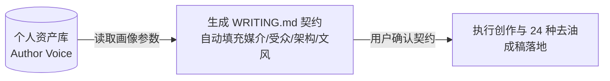

# 个人资产：作者声音画像 (Author Voice Profile)

作者声音画像属于 [Taste Memory](../taste_memory.md)，不属于 [AI 基础审美推理](../aesthetic_intelligence.md)。
它将用户认可的优质文章、个人笔记或代表性文风，解构为**可迁移的深层结构骨架与语言艺术系统**，并沉淀为个人资产库中的专属资产（`system_type: author_voice`）。

<!-- muse:allow text-8: 「一键映射闭环」指画像 → 契约 → 成稿的完整回路，是资产调用流程的术语 -->

> **契约化协同原则**：提取出的声音画像必须与 [WRITING.md](../toolkit/text_narrative_tool.md#四-标准交付契约writingmd-规范) 的五大维度**完全同构**。当用户未来调用该声音画像时，AI 能一键将其转化为新创作任务的 `WRITING.md` 契约配置。

---

## 一、 提取意图与三种状态

| 用户意图 | 如何处理 | 是否写入个人资产库 |
|---|---|---|
| “这次按这些样本帮我改/写” | 把样本当作当前任务材料，提取临时观察直接应用 | 否 |
| “学习/保存这个写法，以后可以调用” | 提取为带真实证据引用的 `system_type: author_voice` 资产 | **是** |
| “以后记住这条写作偏好” | 在声音画像之外，将明确准则写入带 scope 的 confirmed preference | **是** |

---

## 二、 声音画像五大提取维度 (与 WRITING.md 深度同构)

提取时必须深入以下五层关系网络，严禁停留在表层字词统计：

```
┌────────────────────────────────────────────────────────────────────────┐
│ 1. 【媒介载体与适用边界】适用的最佳物理载体（长专栏/短社交/UI/Prompt）及边界 │
├────────────────────────────────────────────────────────────────────────┤
│ 2. 【受众心智定位】作者假定的读者认知段位（零门槛小白 / 挑剔极客 / 决策者） │
├────────────────────────────────────────────────────────────────────────┤
│ 3. 【深层架构与推进骨架】识别核心架构类型（金字塔/文学/转化/剥茧）及动线图 │
├────────────────────────────────────────────────────────────────────────┤
│ 4. 【语言艺术与具象特征】具象生活客体比喻库 + 短决断长因果音律 + 态度锋芒   │
├────────────────────────────────────────────────────────────────────────┤
│ 5. 【审美禁区与反套路规则】作者严格规避的 AI 腔、套话与虚浮升华习惯          │
└────────────────────────────────────────────────────────────────────────┘
```

### 1. 媒介载体与适用边界 (Medium & Scope Fit)
* **观察提炼**：范文最适合在什么媒介上阅读（如：公众号深度专栏、小红书图文、网站说明、Prompt 指令、私人随笔）？
* **边界约束**：明确该声音画像**不适用的场景**（例如：深度专栏文风严禁直接套用到即刻短动态，避免水土不服）。

### 2. 受众心智定位 (Audience Persona)
* **观察提炼**：作者在对谁说话？假定的读者认知储备是新手小白、一线技术骨干，还是企业高管？
* **站位关系**：作者与读者的社交距离（平视切磋、冷峻观察、温和同理，还是犀利复盘）。

### 3. 深层架构与推进骨架 (Structural Archetype & Outline Flow)
识别范文的核心推进建筑学：
* **核心架构模型**：
  * `金字塔效率架构`：结论与主张先行 ➔ 分流支柱 ➔ 证据落点；
  * `文学叙事张力架构`：具象场景锚点 ➔ 冲突困境 ➔ 认知顿悟 ➔ 留白余韵；
  * `商业痛点转化漏斗`：Hook 痛点 ➔ Empathy 共情 ➔ Value 解法 ➔ Proof 证据 ➔ Action 动作；
  * `侦探式层层剥茧架构`：反常翻车现象 ➔ 破除伪因 ➔ 还原底层机制 ➔ 沉淀法则。
* **推进动线图**：提炼出 3~5 个段落的推进逻辑链条（Outline Flow）。

### 4. 语言艺术与具象特征 (Voice & Craft)
* **具象客体比喻库**：提取作者习惯调用的真实生活与工作细节（例如：代码报错日志、寒风中单手叫车、40页没人看的汇报 PPT），拒绝悬浮形容词。
* **句法音律与呼吸**：长短句如何交错；短句是否承担决断落点；长句如何承载限定与因果；连续句子的开头是否刻意破格。
* **态度锋芒**：锁定文风基调（冷峻极客 / 犀利主编 / 温和同行 / 电报式极简）。

### 5. 审美禁区与反套路习惯 (Avoid & Anti-Slop)
* 提取作者在行文中**坚决不用、刻意规避的表达方式**：
  * 拒绝“在当今时代/众所周知”等开场白；
  * 拒绝“不仅是……更是……”假深刻排比；
  * 拒绝文末无意义的大团圆口号升华；
  * 拒绝无依据的宏大意义定性（标志着/见证了/赋能）。

---

## 三、 保存结构与数据格式

按 [资产格式](../asset_schema.md) 保存进个人资产库：

1. `reference`：保存作者样本原文摘录、来源媒介与可定位证据。
2. `system`：设置 `system_type: author_voice`、`media: ["text"]`，并在 `principles` 中结构化记录上述 5 大维度的原则。

### 示例画像资产 (YAML 呈现)

```yaml
name: "investigative_tech_voice"
system_type: "author_voice"
media: ["text"]
intent: "侦探式剥茧、一针见血、具有一线实战泥土味的技术与商业专栏文风"
scope:
  mediums: ["公众号深度长文", "技术专栏", "复盘报告"]
  incompatible: ["短平快推销", "纯抒情散文"]
principles:
  - category: "audience"
    rule: "面向 2~5 年一线技术与产品从业者，直击自我感动痛点，拒绝常识性科普"
    evidence: "sample.md#L12-18"
  - category: "architecture"
    rule: "采用侦探式层层剥茧架构：翻车事故切入 ➔ 破除伪因 ➔ 还原真凶 ➔ 动作收束"
    evidence: "sample.md#L30-80"
  - category: "style"
    rule: "具体客体驱动（特定弹窗、工单日志、单手冷风操作），短句给断言，长句拆因果"
    evidence: "sample.md#L45-60"
  - category: "anti_slop"
    rule: "封杀不仅是更是、封杀时代空话、文末停在行动清单严禁大团圆口号"
    evidence: "sample.md#L90-110"
limits:
  - "单一样本不代表作者在日常聊天中的语气"
```

---

## 四、 一键映射与调用工作流

当用户在后续创作中要求调用该声音画像时，AI 严格执行以下**一键映射闭环**：



1. **自动读取并填充 `WRITING.md`**：
   * 将画像中的 `scope.mediums` ➔ 填入 `WRITING.md` 第 1 节（媒介载体）；
   * 将画像中的 `audience` 原则 ➔ 填入 `WRITING.md` 第 2 节（受众心智）；
   * 将画像中的 `architecture` 骨架 ➔ 填入 `WRITING.md` 第 3 节（深层架构）；
   * 将画像中的 `style` 与 `anti_slop` ➔ 填入 `WRITING.md` 第 4、5 节（文风与禁区）。
2. **生成并接受用户微调**：
   * 优先迁移文章的**“认知关系、推进动线与音律呼吸”**，严禁机械复制原作者的某几个特定口头禅。
   * 用户若反馈“这里不像我”，先精修当前段落，再将调整以增量更新方式回写资产库。
