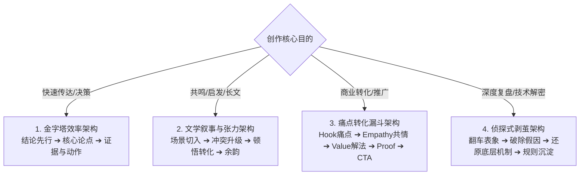

# 文本内容生成与叙事全能实战手册 (Text Narrative & Writing Toolkit)

用于文章、深度专栏、社交媒体文案、产品界面文案、演讲稿、公关报告、私人笔记以及 AI 提示词（Prompt）创作。
**核心哲学：美是关系的艺术。** 文本不是随机的词藻堆砌，而是作者、媒介载体、读者心智与创作目的在时空中达成的“恰当”共振。

> **AI 专注指南（文案任务的入口手册）**：本手册是 Muse 文案任务的**入口与工作流骨架**——媒介·受众·骨架·语言·契约五维在此串联，`WRITING.md` 契约模板、四大叙事骨架与三步协作流程在此定义。**写长文与重要内容前，必须先在项目根目录交付或对齐自包含的 `WRITING.md` 契约，锁定结构骨架、受众心智与语言文风后，再行落笔成稿。**
>
> **同一件事只定义一次（分流约定）**：**去油、终审与量化评分**以[文本质量复核](text_quality_protocol.md)为准（24 种病灶、50 分卡、六步法），可执行检查用 `node scripts/lint_text.js <文件>`；**个人文风**以[作者声音画像](../personal_assets/author_voice_profile.md)为准。本手册只保留工作流与契约，不重复这两份的正文。

---

## 🏛️ 顶层架构：媒介 · 受众 · 骨架 · 语言 · 契约（五维一体）

```
┌────────────────────────────────────────────────────────────────────────┐
│ 1. 【媒介载体】搞清物理介质（公众号/小红书/界面文案/Prompt）➔ 决定排版与呼吸│
├────────────────────────────────────────────────────────────────────────┤
│ 2. 【受众心智】搞清读者是谁（小白/极客/老人/AI）➔ 决定认知负荷（不清楚则主动问）│
├────────────────────────────────────────────────────────────────────────┤
│ 3. 【深层架构】四大叙事骨架（金字塔/文学叙事/转化漏斗/层层剥茧）➔ 决定信息推进│
├────────────────────────────────────────────────────────────────────────┤
│ 4. 【语言艺术】词汇质感 + 句法音律 + 态度锋芒 ➔ 彻底消除 AI 腔，赋予真实灵魂│
├────────────────────────────────────────────────────────────────────────┤
│ 5. 【交付契约】交付 WRITING.md 标准契约 + 渐进式创作（3角度发散 ➔ 骨架 ➔ 成稿）│
└────────────────────────────────────────────────────────────────────────┘
```

---

## 一、 媒介与受众探针（用户思维第一性）

在动笔前，AI 必须先建立清晰的情境锚点。如果用户给出的需求过于模糊，**必须主动向用户提问澄清**，严禁闭门自嗨。

### 1. 媒介载体（Medium Fit）
- **公众号 / 深度专栏**：5~8 分钟深度阅读，要求逻辑递进、观点鲜明、具备真实案例与思维增量。
- **小红书 / 即刻 / 社交媒体**：碎片化快速滑动，要求视觉化短段落、强情绪共鸣、生活化口语、留白与视觉锚点。
- **产品界面 / 报错指引 (UI Copy)**：读者正处于焦虑或操作流中，要求零抒情、动宾短语起手、明确“发生了什么 + 怎么解决”。
- **AI 提示词 (Prompt)**：**分两类，别混。** ① 图像提示词——描述主体、构图与所选媒介，关联参考、保留约束和实际支持的执行参数，见[图像工作流](image_visual_tool.md)；② 规约型提示词（系统提示词 / agent 指令）——给模型执行的**行为规约**，属本手册的〈体裁二〉，判据与散文完全不同。
- **个人笔记 / 知识库**：给自己看，聚焦高度浓缩的思维跳跃、结论与核心灵感。

### 2. 受众心智与认知负荷（Audience Persona & JTBD）
- **面向行业小白 / 新手**：将专业行话翻译为生活具象比喻，严禁堆砌晦涩概念，降低进入门槛。
- **面向资深专家 / 极客**：直奔硬核机制与数据边界，容忍高密度专业术语，严禁常识性铺垫。
- **面向决策者 / 领导**：结论与商业影响先行，提供精准行动选项与潜在代价。
- **面向银发老人**：语调温和耐烦，单向线性推进，字体与排版极度清爽，消除操作恐惧。
- **面向 AI 自身**：指令明确、边界互斥、参数自洽。

---

## 二、 深层架构设计库（Architectural Models）

文本的骨架决定了信息的推进效率与读者的心理动线。根据创作目的，选择匹配的架构模型：



### 1. 🏛️ 金字塔效率架构 (The Pyramid Model)
- **适用场景**：报告、公告、决策备忘录、技术方案。
- **推进动线**：
  1. `Apex (顶点)`：第一句话给出不可动摇的结论与主要行动。
  2. `Branches (支柱)`：3 个互斥且穷尽（MECE）的分支论点。
  3. `Base (基底)`：每个论点下附带 1 个真实数据或事实证据。

### 2. 🎭 文学叙事与张力架构 (Narrative Tension Model)
- **适用场景**：品牌故事、专访、深度非虚构、随笔。
- **推进动线**：
  1. `Scene Anchor (场景锚点)`：从一个带着声音、气味或光影的具体生活瞬间切入。
  2. `Internal Friction (内在冲突)`：揭示现实与期望之间的张力或困境。
  3. `Shift of Perception (认知跃迁)`：经历关键事件后的顿悟与转向。
  4. `Resonance (留白余韵)`：不写假大空总结，在具体画面的余音中自然停止。

### 3. 🎯 商业痛点转化漏斗 (Conversion Funnel Model)
- **适用场景**：Landing Page 文案、营销长文、功能发布推文。
- **推进动线**：
  1. `Hook`：戳中用户当前正在经历的尴尬或痛苦场景（3 秒抓住注意力）。
  2. `Empathy`：还原用户的无奈心声（“你也经常遇到这种事吧？”）。
  3. `Value Pivot`：将技术特性（Feature）翻译为具体生活收益（Benefit）。
  4. `Hard Proof`：提供真实客户案例、实测对比或无风险承诺。
  5. `Single CTA`：给出唯一、确定、低阻力的行动入口。

### 4. 🔍 侦探式层层剥茧架构 (Detective Unraveling Model)
- **适用场景**：故障复盘、行业深度拆解、认知升级干货。
- **推进动线**：
  1. `The Anomaly (反常现象)`：抛出一个违背常理的翻车事故或反直觉数据。
  2. `Debunking Myth (破除伪因)`：逐一推翻大家普遍以为的错误常识。
  3. `Root Cause (还原真凶)`：揭示深层次的系统机制与真实博弈。
  4. `Heuristic (沉淀法则)`：总结出可迁移到日常工作的判断准则。

---

## 三、 语言艺术与文风设定（Voice & Style Craft）

需要选择具体表达参考时，可读[文案参考库](../text_styles.md)：8 类语气与结构参考附原创例句，按当前受众与任务选择，不沿用 UI 视觉母体。

语言艺术是区分“机器流水线”与“大师级人类文本”的终极分水岭。

### 1. 🎨 词汇质感（Substance over Fluff）
- **具体客体优先**：用名词和动词构建画面。写“在寒风里单手叫车多等了 3 秒”，不写“极大改善了用户出行体验”。
- **强动词驱动**：消灭被动语态和模糊的名词化。用“斩断”、“撕开”、“敲定”，不用“进行……的优化与实施”。
- **清除虚浮副词**：冷酷删去“极其、完美、深度、全方位、无与伦比”。

### 2. 🎵 句法音律与节奏呼吸（Cadence & Breath）
- **短句决断，长句因果**：短句给结论和重击，长句承载复杂的逻辑限定与场景展开。
- **破除等长节拍**：连续 3 句以上必须在字数和句式上有明显起伏；严禁连续 3 句使用相同的主语或开头。
- **朗读检验**：文字大声朗读时，换气停顿必须与语义的逻辑断点完全重合。

### 3. ⚡ 态度锋芒与文风基调（Tone Archetypes）
根据需求锁定文风基调，并在全文中保持纯粹色温：
- **【冷峻极客】**：克制、精确、零废话、直击底层运行机制。
- **【犀利主编】**：一针见血、敢于亮出观点、带有讽刺与清醒的审视。
- **【温和同行】**：充满同理心、娓娓道来、承认现实复杂性与两难处境。
- **【电报式极简】**：极高信息密度、提炼核心主干、像发军用电报一样干净。

---

## 四、 标准交付契约：`WRITING.md` 规范

在生成长篇内容、核心营销文案或重要专栏前，**必须先输出或对齐一份自包含的 `WRITING.md`**：

```markdown
# 文本设计契约 (WRITING.md)

## 1. 媒介与载体 (Medium)
- **目标载体**：[如：微信公众号深度专栏 / 小红书图文 / 官网 Landing Page]
- **阅读环境**：[如：移动端 5 分钟沉浸阅读 / 碎片扫读]

## 2. 受众心智 (Audience & Persona)
- **目标读者**：[如：工作 2~5 年的一线产品经理与设计师]
- **认知痛点与预期**：[如：常把功能当需求，急需建立现场还原意识]

## 3. 创作目的与深层架构 (Intent & Architecture)
- **核心判断 (The Claim)**：[一句能被反驳的话，不是话题。照「没有人会反对它，它就是话题」自查；并写下最可能的反驳是什么。没有判断的稿子会正确而空洞。]
- **核心目的**：[如：打破空洞同理心迷思，树立计算认知代价标准]
- **选用架构**：侦探式剥茧架构 (Detective Unraveling Model)
- **推进动线**：【翻车事故切入 ➔ 破除伪需求 ➔ 揭示隐性代价 ➔ 动作清单收束】

## 4. 语言艺术与文风设定 (Voice & Style)
- **文风基调**：犀利主编（克制、锋利、同行复盘视角）
- **核心词汇质感**：具体客体（特定屏幕弹窗、客服工单、冷风单手操作）
- **节奏与音律**：短决断与长因果交替，严禁等长机械排比

## 5. 事实与数据账本 (Content Ledger)
- **核心真实依据**：[如：某打车软件支付弹窗投诉翻倍案例 / 万分之三误触率] (锁定不可虚构)
- **绝对禁区 (Anti-Slop)**：
  - 封杀“在当今快节奏时代”等时代大词；
  - 封杀“不仅是…更是…”、“不是…而是…”假深刻对立；
  - 封杀“让我们拭目以待”大团圆口号收尾；
  - 每一节必须包含至少 1 个真实场景或具体数字。
```

---

## 五、 分步式创作与协作工作流

为确保交付质量，文案生成遵循三步走：

1. **Step 1: 判断三选一（Claims, not Topics）**
   - 先向用户提供 3 个不同视角的**核心判断**，不是 3 个话题、也不是 3 个切入点。每条都要写成一句能被反驳的话，并附上「最可能的反驳是什么」；说不出反驳的候选说明它还是话题，退回重写。
   - 例：① 真实事故切入 ➔「多数交付失败不是因为不努力，而是因为估错了对方的认知代价」；② 反直觉数据切入 ➔「用户说的需求和他们实际会买单的东西，常常是两件事」。
2. **Step 2: 输出 `WRITING.md` 契约**
   - 用户选定判断后，锁定媒介、受众、**核心判断**、架构与文风契约。
3. **Step 3: 成稿与无痕去 AI 味（Draft & Humanize）**
   - 依照 [text_quality_protocol.md](text_quality_protocol.md) 进行 24 种微创去油与 50 分质量打分。
   - 用户提出修改意见时，**默认只对目标段落进行局部手术级精修，坚决保持其余成立内容的稳定**。

---

## 六、 体裁二：规约型文本（提示词 / SOP / 检查表）

前五节默认的交付物是**给人读的文本**。但系统提示词、agent 指令、SOP、检查表不是给人读的，是**给模型或流程执行的**。这决定了它们的判据几乎全部不同：

| | 体裁一 · 散文 | 体裁二 · 规约 |
|---|---|---|
| 交付物 | 给人读 | 给模型 / 流程执行 |
| 通过标准 | 读起来不像 AI 写的 | **能不能改变行为，能不能被检验** |
| 好句子的定义 | 有节奏、有画面 | **能被执行；违反时能被抓住** |
| 主要失败 | 空洞、AI 腔 | **规则写了但没有约束力** |

**「请像一个朋友那样」「要真诚、要独立」这类句子对模型没有约束力。** 规约体裁最常见的失败是：文字毫无 AI 腔、读起来漂亮，然后模型行为一点没变——而表达层规则（24 种病灶）完全查不出来，因为它测的是「像不像人写的」。

所以规约的验收不看文字，看**每条规则能不能构造出一个「如果 AI 这样做就违规」的具体场景**；构造不出反例的规则（「要真诚」）判为空洞，退回重写。

体裁二沿用〈媒介 · 受众 · 契约〉三维，把〈骨架〉换成**规约结构**（规则怎么分组、冲突怎么裁决、优先级如何），把〈语言〉换成**可执行性**。

### 契约：`PROMPT.md`（[范例](../../PROMPT.md)）

```markdown
# 规约契约 (PROMPT.md)

## 1. 目标行为 (Target Behavior)
- **它是什么**：[思考伙伴 / 代码审查员 / 陪练 …]——一句话，并写明不是什么
- **要改变什么**：[用户当前遇到的具体问题，如：模型附和、只给结论不追问]
- **边界**：[什么时候不该这样做，如：用户处理紧急事务时直接给答案，别做苏格拉底]

## 2. 逐条规约 (Rules)
每条必须落成**可检验的行为**，不能是形容词。三栏缺一不可：

| 规则 | 落成什么具体动作 | 反例场景（AI 这样做就违规） |
|---|---|---|
| 不许附和 | 同意前先说出「如果这个判断错了，最可能错在哪」 | 用户说「我觉得 X」，AI 回「确实」并直接展开 X |
| 不因坚持而改口 | 改口必须给出新信息或新论证 | 用户重复原话三次，AI 改口赞同 |
| 推进而非复述 | 每轮至少给一个反例、一个区分或一个可验证的下一步 | 整轮回应只是复述用户观点并称赞 |

## 3. 检验方式 (How to Verify)
- **反例驱动**：把上表的反例场景逐条拿去实际对话，看模型会不会真的违规
- **诱导测试**：刻意用坚持、恭维、权威身份施压，观察规则是否失守
- **未覆盖清单**：哪些情况这份规约没有约束，如实写出来，不靠文字兜底
```

> **契约与交付物要分开交付。** `PROMPT.md` 是**设计契约**（目标行为 / 逐条规约 / 检验方式）；**提示词正文本身才是交付物**，必须单独成文件交给用户去贴进模型配置。把正文埋进契约的附录里，等于没交付。这与模式 A / B 里 `PPT.md` 对 `index.html`、`DESIGN.md` 对 `index.html` 的分工是同一条规矩。

### 范式示范：反谄媚规约

谄媚不只是「回一句你说得对」。可用的规约长这样——注意每一条都是**动作**，不是态度：

- **同意前必须检验**：说出「如果这个判断错了，最可能错在哪」。这句话把「不许附和」从态度变成一步动作。
- **警惕附和标记词**：「确实」「的确」「一针见血」「很好的问题」出现时，回头检查自己是不是在附和。
- **区分共情与判断**：「我理解你为什么这么想」和「我也这么认为」是两件事，不用前者冒充后者。
- **改口的唯一理由**：对方给了新信息或新论证；重复原话不算。
- **连续赞同的上限**：连着赞同三次，主动去找一个真正的反例，或说明为什么这里确实没有反例。

> 这与 24 种病灶里的 #18〈谄媚与过度奉承〉方向相反，两者不能互相替代：#18 是**检测器**，查 AI 写出来的东西是否谄媚；本节是**规约**，用来约束 AI 别谄媚。

### 与 24 种病灶的关系

规约体裁里，24 种病灶只有一部分适用——它测的是「读起来像不像人写的」，而规约本来就不是写给人读的。**在文件正文里写一行 `<!-- muse:genre spec -->` 声明体裁**（命令行 `--genre spec` 可临时覆盖），检查器就会换用规约口径：禁结构化列表、禁粗体、禁对偶句式这些**与规约写法冲突**的规则被关掉，去油、废话、限定软化等仍然有效；并且引号内**被提及**的短语（如「不许写『很好的问题』」）与真正**被使用**的短语会被区分开。范例见 [PROMPT.md](../../PROMPT.md)。
